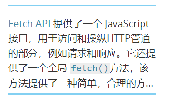

/*
 * @Author: chris 
 * @Date: 2018-06-01 08:33:58 
 * @Last Modified by: chris
 * @Last Modified time: 2018-06-09 23:22:29
 */
### 1、多行后添加省略号   
```css  
    display: -webkit-box;
    -webkit-box-orient: vertical;
    overflow: hidden;
    -webkit-line-clamp: 5;   

```
> 实际效果  
   

### 2、子元素撑开父元素的宽度  
```css  
 父元素： display:inline-block;
         white-space:nowrap;
 子元素： display:inline-block;
```  
* 注意：父元素不能设置width属性      